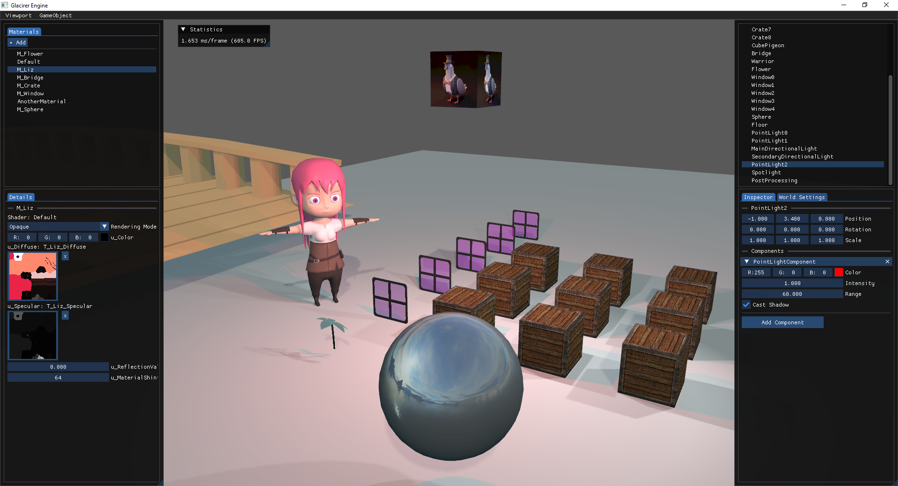
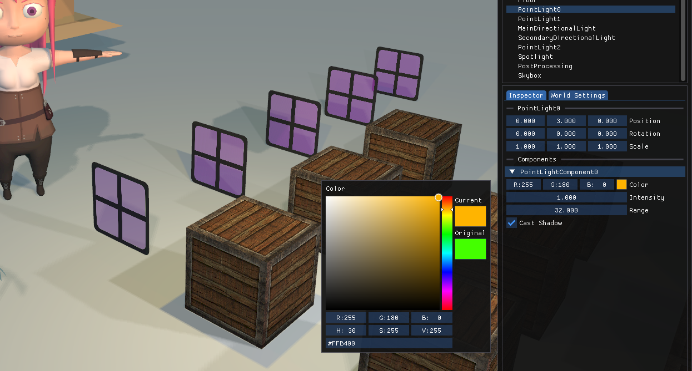
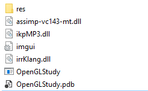

# Glacirer
 OpenGL-Study repository started as a series of studies for learning OpenGL, and it is now gradually growing towards a custom realtime component based rendering engine with a custom editor, now called as Glacirer.

## Download

1. Head to the repository [releases](https://github.com/Nevasca/OpenGL-Study/releases) and download the `.zip` from one of the available versions;
2. Extract and run the `.exe`.

## Editor

### Camera navigation

You can fly around with the camera by using:

* `F`: enable pilot mode to start flying around;
* `ESC`: disable pilot mode to stop flying around and be able to select things on the Editor;
* `Mouse`: look around during pilot mode;
* `Q`: descend camera during pilot mode;
* `E`: ascend camera during pilot mode;
* `Scroll wheel`: increase and decrease camera fov.

### Shortcuts

Besides camera navigation shortcuts explained in the previous section, you can also:

* `Ctrl + Space`: hide/show Editor.

### Game Object Inspector

On the right side of the Editor, you can find the world hierarchy with all currently instantiated game objects:

From there you can select one game object, inspect and modify its components on the Inspector tab below it.
Every game object contains transform values (position, rotation and scale) and their own components.

For changing a point light color, for example, simply select the desired light and modify the `Color` property of the `PointLightComponent`: 

### World Inspector

Continuing on the right side of the Editor, you can find a World Settings tab where you can modify some of the world properties, such as `Ambient Color`:

### Material Inspector

Now to the left side of the Editor. You can find all the current used materials for the world in the Materials tab.
Selecting one of them will present their details on the inspector panel below it, where you can also modify some of their values (changing textures not implemented yet).

## Code base

Open `Glacirer/Glacirer.sln` on Visual Studio or Rider to open the main solution. Inside, you will find the following projects:
* **Engine**: contains the core implementation. The engine is responsible for creating and setting up the window and rendering context, contains the component-based implementation for rendering things on screen. Does not contain any editor or GUI code, this is the responsibility of the Editor project; 
* **Editor**: references the Engine project and creates a GUI using its components and resources.

The idea is to keep core implementations in the Engine project and make it customizable by the Editor project. The Engine should never know that an Editor for it exists, so we can ship the `Engine.dll` to be usable by other projects, such as a game.  

### Compiling

Compile and run the `Glacirer/Glacirer.sln` using `Debug|x64` or `Release|x64` configs.

The custom post-build event should copy the required `.dll` (both Engine.dll and external dependencies) to the Editor's output folder `bin/x64/[Debug|Release]/Editor`. But if for some reason it doesn't, make sure to copy `assimp-vc143-mt.dll`, from the `External` folder to the output folder.

If you run the application by compiling and running inside Visual Studio or Rider, the working directory (solution directory) should be able to find the `EngineData` and `EditorData` folders containing the required resources (shaders, textures, models) for running the application. If you intend on running it outside the IDE, make sure to copy both directories into the root of the application .exe folder, like so:

### Important classes

If you want to dig in how the project works, here are some files to start at:
* `Main.cpp`: Editor entry point (void main()), creates the Editor instance and does the main loop on it;
* `Editor.cpp`: references and initializes the Engine, also calling the Engine:Update and Engine:Render. Initializes the GUI and updates it accordingly; 
* `Engine.cpp`: creates the window and rendering context, it also calls Update and Render for the current World (scene).

# Study projects
As told at the beginning of this Readme, it all started as a study project. You can find the solution for the original study project on the `Studies` folder.
After compiling and running the `OpenGLStudy.sln` described bellow (by expanding the details), you will be presented with an old version of Glacirer together with other study tests.

Just remember that Glacirer solution will contain the most updated version of rendering implementations.

## Code base

### Compiling

Open `Studies/OpenGLStudy.sln` on Visual Studio or Rider to open the main solution. Inside, you will find the OpenGLStudy project containing all the study tests, the custom engine and editor code (refactor to split into separate projects in the way).

Compile and run using `Debug|x64` or `Release|x64` configs.

The custom post-build event should copy the required `.dll` external dependencies to the output folder `bin\x64\[Debug|Release]` (assimp for loading 3D models and irrKlang for audio). But if for some reason it doesn't, make sure to copy `assimp-vc143-mt.dll`, `ikpMP3.dll` and `irrKlang.dll` from the `Dependencies` folder to the output folder.

If you run the application by compiling and running inside Visual Studio or Rider, the working directory should be able to find the `OpenGLStudy\res` folder containing the required resources (shaders, textures, models) for running the application. If you intend on running it outside the IDE, make sure to copy the whole `res` directory into the root of the application .exe folder, like so:

### Important classes

If you want to dig in how the project works, here are some files to start at:
* `OpenGLStudy.cpp`: application entry point (void main()), creates the context window, setup OpenGL and contains the application loop (update and render calls), calling the current opened test;
* `TestCoreSandbox.cpp`: it's the test opened on application startup. Creates and initializes the World and Editor and spawns the game objects you see in this sandbox scene (cubes, character, lights and so on). On this class you can get a good look on how things work on the custom engine, such as spawning game objects and adding components.
* `World.cpp`: core of the engine. It contains methods for spawning new game objects, update the spawned GameObjects, calls the RenderingSystem to render the MeshComponents.
* `EngineEditor.cpp`: core of the engine editor. Receives a reference for the current World and update the GUI for inspecting game objects, components and resources.

### Folder structure
#### OpenGLStudy
* `src/core`: all custom engine related code resides in this folder, such as `World`, `RenderSystem`, `GameObject` and `Component`, `VertexBuffer` and much more.
* `src/editor`: all editor code resides in this folder, such as `EngineEditor`, `GameObjectInspector`, component inspectors.
* `src/legacy`: legacy abstractions for graphics related things, such as vertex buffer and shader used by early studies. Please check the abstractions implemented inside `src/core` for the more updated version.
* `src/tests`: despite the name, it does not contain unit tests. A Test is an abstraction for a separate application inside the main application, which contains Update and Render methods to be called from the main application loop on `OpenGLStudy.cpp`. In this folder you will find the `TestCoreSandbox.cpp` (the sandbox opened on application startup) and other study tests, such as learning how draw a textured quad on screen on the `Test2DTransform.cpp` test    
* `src/vendor`: external third-party code, such as [glm](https://github.com/g-truc/glm) (mathematics), [imgui](https://github.com/ocornut/imgui) (gui) and [stb_image](https://github.com/nothings/stb/blob/master/stb_image.h) (image loader).

Resources are located at the `res` folder (shaders, models, audio and textures).
#### Dependencies

Third-party dependencies:
* [GLFW](https://www.glfw.org/download.html): window and context creation, user input;
* [Glew](https://glew.sourceforge.net/): exposes OpenGL manufacturer driver implementation;
* [Assimp](https://assimp.org/): model loader;
* [Freetype](https://freetype.org/): text font loader and renderer;
* [irrKlang](https://www.ambiera.com/irrklang/downloads.html): sound engine.

## Accessing other study tests

At the beginning of the study, instead of having an engine to keep adding new features as the study progressed, each topic was implemented on a different test "scene".
To access these studies, expand the Test by clicking on the marked arrow and then on the `<-` button:

The application will go back to the main menu and from there you can select one of the available tests:

The startup test is called `CoreSandbox`. `Core` test also uses the Editor and custom engine, but with a simple world.

# Study materials

This repository uses the following resources as a foundation. A special thanks for the authors for creating these amazing learning resources:

* [LearnOpenGL](https://learnopengl.com/) website, by Joey de Vries;
* [Cherno's OpenGL](https://www.youtube.com/playlist?list=PLlrATfBNZ98foTJPJ_Ev03o2oq3-GGOS2) playlist on YouTube;

If you also want to learn computer graphics, I recommend starting through [LearnOpenGL](https://learnopengl.com/), it's hands down the best OpenGL learning material available on the internet.

Take a look at [Cherno's OpenGL](https://www.youtube.com/playlist?list=PLlrATfBNZ98foTJPJ_Ev03o2oq3-GGOS2) playlist if you intend on creating a GUI using [ImGui](https://github.com/ocornut/imgui) ([this video](https://www.youtube.com/watch?v=nVaQuNXueFw&list=PLlrATfBNZ98foTJPJ_Ev03o2oq3-GGOS2&index=23&ab_channel=TheCherno) shows how).

# What comes next

As mentioned at the beginning of this readme, the goal is now to gradually grow the project into a custom realtime rendering engine. At first, as the ultimate goal is to have a fully capable game engine, but let's mature the rendering part first. 

Here are some things required for that:

* Improve general code (tech debts, refactors, better code practices, better entry point and context creation, bug fixes);
* Create unit tests;
* Improve engine performance;
* Improve editor performance;
* Improve directional light shadow quality;
* Implement adding and removing objects on the fly (add a cube, a model to the scene from the Editor instead of adding on code).
* Implement adding and removing resources on the fly (add and apply textures);
* Save and load scenes;
* Implement object picking;
* Gizmos;
* Implement other rendering techniques, such as normal map, ambient occlusion.

All of this to later mature it into a game engine, which will require tons of new things as well (particles, collision, physics, animation, audio, UI).